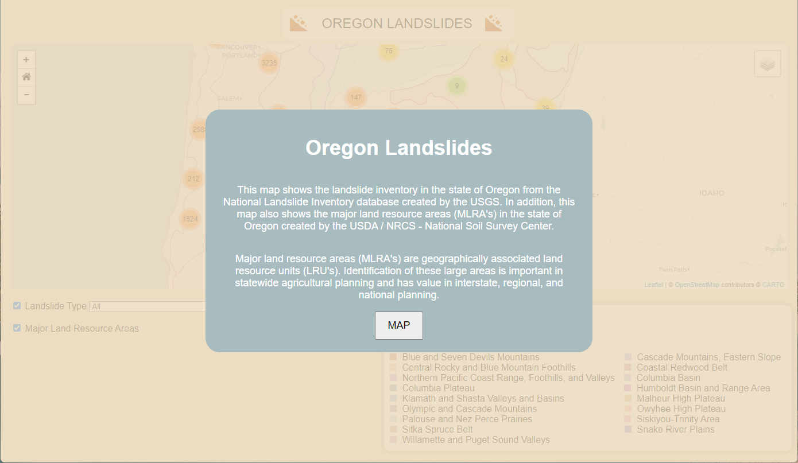
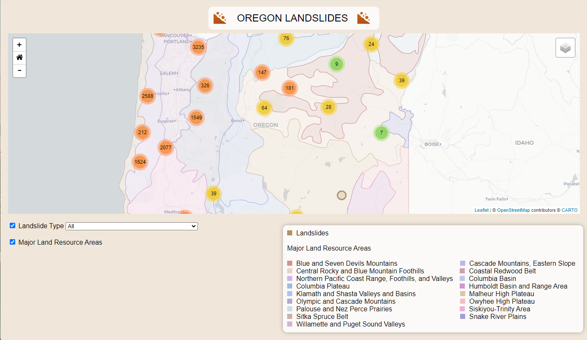
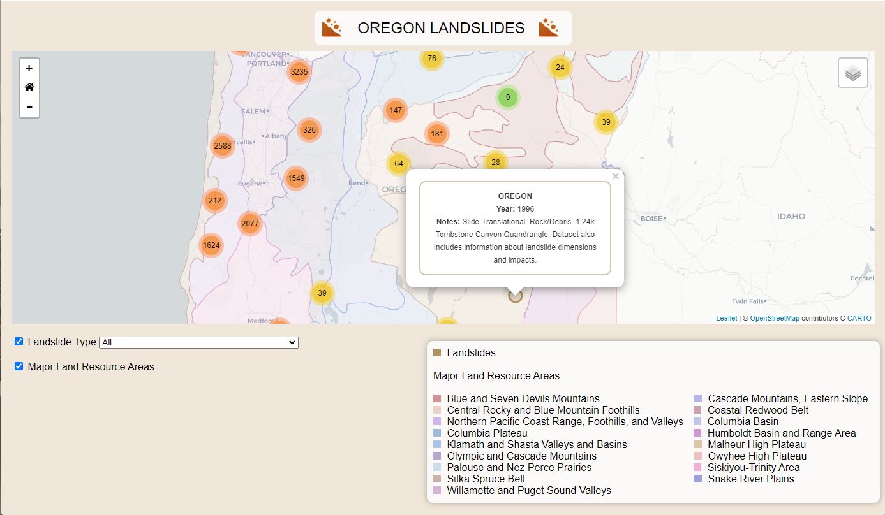

# Final Project
### Oregon Landslides

This map shows the landslide inventory in the state of Oregon from the National Landslide Inventory database created by the USGS.  In addition, this map also shows the major land resource areas (MLRA's) in the state of Oregon created by the USDA / NRCS - National Soil Survey Center.

